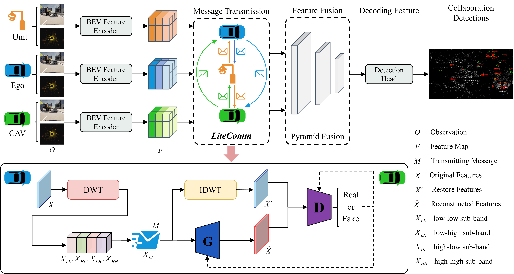
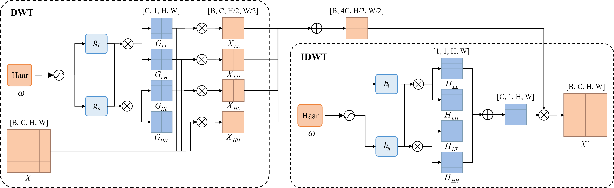

# WaveComm

**[ICRA2026] WaveComm: Lightweight Communication of BEV Feature Maps for Collaborative Perception via Wavelet Feature Distillation**

> This is the official implementation of WaveComm, a wavelet-based communication framework for collaborative perception.

## Overview

WaveComm is a novel collaborative perception framework that achieves communication efficiency by exploiting the frequency structure of feature maps. The core idea is to decompose BEV feature maps using Discrete Wavelet Transform (DWT), transmit only compact low-frequency components, and reconstruct the full features at the receiver using a lightweight generator.

<div align="center">

</div>

## Video

<div align="center">
<video src="assets/ICRA26_WaveComm.mp4" width="80%" controls>
  Your browser does not support the video tag.
</video>
</div>

## Key Features

- **Wavelet Feature Distillation**: Uses DWT to decompose features into low-frequency and high-frequency components. Only low-frequency components are transmitted to reduce bandwidth.
- **Multi-Scale Distillation (MSD) Loss**: A hybrid loss function combining:
  - Reconstruction Loss (pixel-level)
  - SSIM Loss (structural-level)
  - Perceptual Loss (semantic-level)
  - Adversarial Loss (distributional-level)
- **Lightweight Generator**: A lightweight neural network that reconstructs high-frequency details from transmitted low-frequency components.
- **通信效率**: Reduces communication volume to **86.3%** (OPV2V) and **87.0%** (DAIR-V2X) of the original while maintaining state-of-the-art performance.

## Method

<div align="center">

</div>

### Wavelet Feature Distillation Module

The Wavelet Feature Distillation Module consists of two parts:

1. **Feature Decomposition**: Using DWT to decompose BEV features into low-frequency and high-frequency components. Low-frequency components retain most semantic information and global structure.

2. **Feature Reconstruction**: A lightweight generator reconstructs the full feature map from the transmitted low-frequency components. The generator is optimized using MSD Loss to ensure high-fidelity reconstruction.

## Performance

### OPV2V Dataset

| Method | AP50 | AP70 | Comm (MB) |
|--------|------|------|-----------|
| No Collaboration | 0.405 | 0.216 | 0.0 |
| F-Cooper | 0.469 | 0.219 | 22.0 |
| DiscoNet | 0.517 | 0.234 | 22.0 |
| AttFusion | 0.529 | 0.252 | 22.0 |
| V2XViT | 0.603 | 0.289 | 22.0 |
| CoBEVT | 0.571 | 0.261 | 22.0 |
| HM-ViT | 0.643 | 0.370 | 22.0 |
| **WaveComm (ours)** | **0.681** | **0.451** | **19.0** |

### DAIR-V2X Dataset

| Method | AP30 | AP50 | Comm (MB) |
|--------|------|------|-----------|
| No Collaboration | 0.014 | 0.004 | 0.0 |
| F-Cooper | 0.115 | 0.026 | 23.0 |
| DiscoNet | 0.083 | 0.017 | 23.0 |
| V2XViT | 0.198 | 0.057 | 23.0 |
| HM-ViT | 0.163 | 0.044 | 23.0 |
| **WaveComm (ours)** | **0.274** | **0.123** | **20.0** |

## Installation

### Prerequisites

- Python 3.8+
- PyTorch 1.12.0+
- CUDA 11.6+

### Step 1: Create Environment

```bash
conda create -n wavecomm python=3.8
conda activate wavecomm
conda install pytorch==1.12.0 torchvision==0.13.0 torchaudio==0.12.0 cudatoolkit=11.6 -c pytorch -c conda-forge
```

### Step 2: Install Dependencies

```bash
pip install -r requirements.txt
```

### Step 3: Install Spconv

```bash
pip install spconv-cu116  # match your cudatoolkit version
```

### Step 4: Compile Bbx IoU CUDA Version

```bash
python opencood/utils/setup.py build_ext --inplace
```

### Step 5: Install This Project

```bash
python setup.py develop
```

## Data Preparation

### OPV2V Dataset

Please refer to [OpenCOOD](https://github.com/DerrickXuNu/OpenCOOD). You also need to download `additional-001.zip` for camera modality.

### DAIR-V2X Dataset

Download from [DAIR-V2X](https://thudair.baai.ac.cn/index). Use complemented annotation.

Create a `dataset` folder and organize as follows:

```
WaveComm/
└── dataset/
    ├── my_dair_v2x/
    │   ├── v2x_c/
    │   ├── v2x_i/
    │   └── v2x_v/
    └── OPV2V/
        ├── additional/
        ├── test/
        ├── train/
        └── validate/
```

## Training

### Train the Model

```bash
python opencood/tools/train.py -y ${CONFIG_FILE} [--model_dir ${CHECKPOINT_FOLDER}]
```

Arguments:
- `-y` or `--hypes_yaml`: Path to training configuration file
- `--model_dir` (optional): Path to checkpoint for fine-tuning or continuing training

### Train with DDP

```bash
CUDA_VISIBLE_DEVICES=0,1 python -m torch.distributed.launch --nproc_per_node=2 --use_env opencood/tools/train_ddp.py -y ${CONFIG_FILE}
```

## Testing

```bash
python opencood/tools/inference.py --model_dir ${CHECKPOINT_FOLDER} [--fusion_method intermediate]
```

## Project Structure

```
WaveComm/
├── opencood/
│   ├── hypes_yaml/          # Configuration files
│   ├── models/              # Model architectures
│   │   └── comm_modules/    # Communication modules
│   ├── data_utils/          # Data loading and preprocessing
│   ├── fuse_modules/        # Feature fusion modules
│   ├── loss/                # Loss functions
│   ├── utils/               # Utility functions
│   └── tools/               # Training and testing scripts
├── dataset/                 # Dataset directory
├── assets/                  # assets for README
└── README.md
```

## Citation

```latex
@article{wavecomm2026,
  title={WaveComm: Lightweight Communication of BEV Feature Maps for Collaborative Perception via Wavelet Feature Distillation},
  author={},
  journal={},
  year={2026}
}
```

## Acknowledgments

This project is built upon the [OpenCOOD](https://github.com/DerrickXuNu/OpenCOOD) and [HEAL](https://github.com/yifanlu0227/HEAL) frameworks. We thank the authors for their excellent work.
